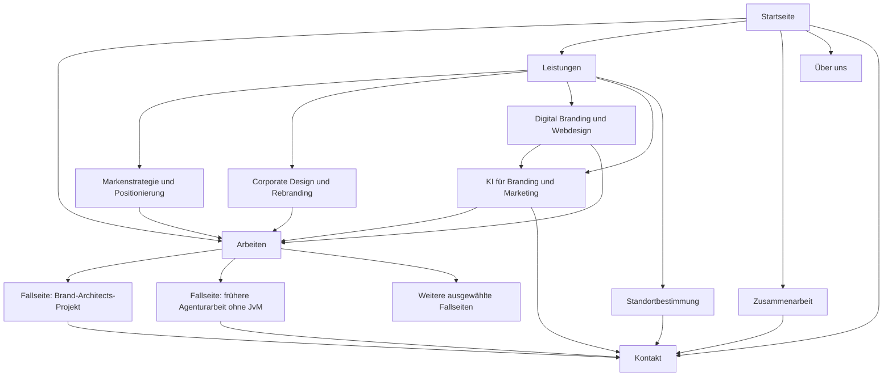

# Brand Architects: Website-Briefing

## Struktur, Aufbau, Inhalte und Nutzerführung

**Verbindliche Arbeitsrichtung für Konzeption, Design, Redaktion und Umsetzung · Fassung 1.3**

**Angebotserweiterung:** Drei Leistungsbereiche mit eigenen Vertiefungen und eine ergänzende Seite «KI für Branding & Marketing» sind vorgesehen. Digital Branding und Webdesign sind bestehendes Angebot. Pascal bestätigt zusätzlich Content-Prozesse mit KI, KI-gestützte Software- und Produktentwicklung sowie agentische Branding- und Marketingprozesse. Die konkreten Belege und Lieferumfänge werden redaktionell ausgearbeitet.

**Ergänzung aus dem Wettbewerbsabgleich:** Die Verbindung von Leistungen und Cases, der Umgang mit älteren Arbeiten, die Platzierung von Belegen sowie die Priorität eines späteren Entscheidungsratgebers sind in den Abschnitten 5, 8 und 12 konkretisiert. Die Hauptnavigation bleibt gleich.

Dieses eigenständige Briefing konkretisiert das [finale Strategiebriefing, Fassung 2.2](/Users/pascalfrey/.codex/.chatgpt-projects/g-p-6aa0063c2a7c8191945b5c9fae017abf/Brand-Architects-Finales-Strategie-und-Website-Briefing.md). Das Strategiebriefing bestimmt Positionierung und Kommunikation; dieses Dokument bestimmt die Seiten, ihre Reihenfolge, Inhaltsanforderungen und Funktionen. Frühere Vorschläge einer prominenten Personenpositionierung gelten nicht.

**Portfolio-Präzisierung:** Mehrere Cases sind laut Pascal vorhanden und können aufbereitet werden. Geplant sind eigene Brand-Architects-Projekte und ausgewählte frühere Agenturarbeiten, ausdrücklich ohne Jung von Matt (JvM). Zwei Fälle sind die kuratierte Startseitenauswahl; die Arbeiten-Übersicht und das Fallseitensystem sind für den gesamten geeigneten Bestand vorgesehen.

**Verwendung:** Arbeitsdokument für die Umsetzung, kein vollständig zu veröffentlichender Website-Text. Nur entsprechend bezeichnete Textvorschläge gehören in die Redaktion. Angaben zu interner Organisation und offene Nachweise bleiben ausserhalb der öffentlichen Website.

---

## 1. Auftrag und Gestaltungsentscheidung

### Ziel der Website

Geeignete Auftraggeber sollen verstehen, wann Brand Architects die richtige Wahl ist, die Kompetenz an konkreten Arbeiten beurteilen und ein Gespräch anfragen.

**Primärziel:** qualifizierte Projektanfragen.  
**Hauptaktion:** Projekt besprechen.  
**Zweite Aktion:** Arbeiten ansehen.

### Zielgruppe und Kaufsituation

Geschäftsleitungen und Marketingverantwortliche etablierter Schweizer Unternehmen, deren Angebot oder Ausrichtung sich weiterentwickelt hat und deren Marke dies noch nicht angemessen vermittelt. Ein neuer Marken- oder Website-Auftritt ist ein typischer Anlass. Für Marketing und spätere Anwender zählen zusätzlich klare Zuständigkeiten und nutzbare Ergebnisse.

Der Besucher soll denken: **«Die verstehen unsere Situation, zeigen relevante Arbeit und erklären, wie wir zu einem brauchbaren Ergebnis kommen.»**

### Leitidee

> Ihr Unternehmen ist weiter. Jetzt muss Ihre Marke mit.

**Erklärung des Angebots:** Brand Architects klärt Positionierung und Botschaften und übersetzt sie in Sprache, Design und digitale Auftritte. Ergänzend entwickelt die Agentur Content-Prozesse mit KI, digitale Produkte und Abläufe für Branding und Marketing.

### Die zentrale Entscheidung für den Aufbau

**Kurze Einordnung → frühe Arbeit → Situation vertiefen → Angebot erklären → Einstieg und Zusammenarbeit → Kontakt.**

Die Besucher müssen weder eine lange Agenturgeschichte lesen noch zuerst ein Beratungsgespräch buchen, um die Leistung zu verstehen. Das Portfolio erhält früh Raum; Aufgabenbeschreibung und Rollenangabe machen die Bilder zu Beweisen.

Die Agentur ist der Absender. Pascals Profil erscheint als kurzer Gründerhinweis auf «Über uns». Auf früheren Agenturprojekten wird zusätzlich seine damalige Rolle sachlich ausgewiesen. Diese Projektcredits sind keine ausführliche Personenpositionierung. Ausserhalb notwendiger Angaben steht seine Person nicht in wiederkehrenden Seitenelementen.

---

## 2. Umfang und Sitemap

### Empfohlener Startumfang

**Sieben Basisseiten, drei vertiefende Leistungsseiten, eine ergänzende KI-Angebotsseite, eine Fallseite pro ausgewähltem Projekt sowie Impressum und Datenschutz.** Das Portfolio ist nicht auf zwei Fälle begrenzt. Die genaue Anzahl ergibt sich aus dem zu sichtenden Bestand. Die Leistungsübersicht erklärt die drei Bereiche; «Markenstrategie & Positionierung», «Corporate Design & Rebranding» und «Digital Branding & Webdesign» werden zusätzlich vertieft. «KI für Branding & Marketing» erhält eine eigene Seite für die ergänzenden Leistungen. Anwendung und Einführung bleiben in alle vereinbarten Leistungsumfänge integriert. Die Standortbestimmung erhält eine eigene Angebotsseite.

Die vier Angebotsvertiefungen werden mit konkreten Ergebnissen, Arbeitsbeispielen und eigenen Inhalten aus dem vorhandenen Portfolio aufgebaut. Sind diese Inhalte zum Launch noch nicht fertig, bleiben die entsprechenden Leistungen zunächst als Abschnitte der Übersicht bestehen. Es werden keine leeren oder nahezu identischen Unterseiten veröffentlicht.

| Seite | Vorgesehene Adresse | Hauptfrage des Besuchers | Weiterführende Handlung |
|---|---|---|---|
| Startseite | `/` | Passt Brand Architects zu unserer Situation? | Arbeit prüfen oder Projekt besprechen |
| Arbeiten | `/arbeiten/` | Welche vergleichbaren Aufgaben hat die Agentur bearbeitet? | Einen Fall öffnen |
| Fallstudie, je Projekt | `/arbeiten/projektname/` | Was wurde genau geleistet und warum? | Ähnliches Projekt besprechen |
| Leistungen | `/leistungen/` | Welche Unterstützung erhalten wir? | Standortbestimmung ansehen oder anfragen |
| Markenstrategie & Positionierung | `/leistungen/markenstrategie-positionierung/` | Welche Markenentscheidungen müssen wir klären? | Passenden Case oder Standortbestimmung ansehen |
| Corporate Design & Rebranding | `/leistungen/corporate-design-rebranding/` | Wie wird unsere Ausrichtung in einem nutzbaren Auftritt sichtbar? | Passenden Case ansehen oder Projekt besprechen |
| Digital Branding & Webdesign | `/leistungen/digital-branding-webdesign/` | Wie wird unsere Marke auf der Website verständlich und nutzbar? | Digitalen Case ansehen oder Website-Projekt besprechen |
| KI für Branding & Marketing | `/leistungen/ki-branding-marketing/` | Welche Content-Prozesse, digitalen Produkte oder Abläufe helfen uns konkret? | Beispiel prüfen oder Aufgabe besprechen |
| Standortbestimmung | `/standortbestimmung/` | Wie finden wir heraus, was verändert werden muss? | Standortbestimmung besprechen |
| Zusammenarbeit | `/zusammenarbeit/` | Wie beherrschbar ist der Auftrag für uns? | Projekt besprechen |
| Über uns | `/ueber-uns/` | Wer ist die Agentur hinter der Arbeit? | Arbeiten ansehen oder Kontakt aufnehmen |
| Kontakt | `/kontakt/` | Wie erläutern wir unsere Aufgabe? | Anfrage senden |
| Impressum / Datenschutz | `/impressum/`, `/datenschutz/` | Wer ist der Anbieter, wie wird mit Daten umgegangen? | Informationen lesen |

Die Projektadressen sind Strukturvorschläge, keine bereits existierenden Seiten. Die tatsächlichen Slugs werden aus den ausgewählten Projekten gebildet.

### Header

**Logo links:** Link zur Startseite.  
**Navigation:** Arbeiten · Leistungen · Zusammenarbeit · Über uns.  
**Hervorgehobene Aktion rechts:** Projekt besprechen → `/kontakt/`.

Auf Mobilgeräten stehen Logo und klar bezeichnete Menüöffnung im Header. Die Anfrageaktion bleibt im geöffneten Menü gut sichtbar. Eine zusätzliche dauerhaft überlagernde Schaltfläche ist zum Start nicht vorgesehen.

### Footer

Agenturname, kurze Leistungseinordnung, verifizierte Geschäftsadresse in Würenlos, E-Mail und Links zu den Hauptseiten sowie Impressum und Datenschutz. Eine Telefonnummer nur, wenn sie als öffentlicher Agenturkontakt vorgesehen ist. Soziale Profile nur verlinken, wenn sie aktuell und für die Agentur sinnvoll sind.

### Spätere Erweiterungen

Weitere Fallseiten können jederzeit ergänzt werden. Als erste redaktionelle Erweiterung ist ein einzelner Entscheidungsratgeber vorgesehen: «Marke schärfen, Auftritt auffrischen oder neu entwickeln?» Er braucht keinen laufenden Blog und keinen neuen Hauptmenüpunkt. Eine regionale oder eine Branchenseite folgt erst, wenn nachgewiesene Nachfrage und eigenständige Inhalte sie rechtfertigen. Newsletter, Branchenverzeichnis und ein Netz aus Ortsseiten sind kein Bestandteil des Startumfangs. Die KI-Angebotsseite gehört aufgrund der bestätigten Leistungen zum vorgesehenen Umfang. Sie wird publiziert, sobald Anwendungen, Umfang und Belege konkret ausgearbeitet sind; bis dahin bleibt das Angebot auf der Leistungsübersicht sichtbar.

---

## 3. Nutzerwege

Die Besucher dürfen auf jeder Seite einsteigen. Keine wesentliche Aussage setzt voraus, dass vorher die Startseite gelesen wurde.

| Ausgangslage | Wahrscheinlicher Weg | Was dieser Weg leisten muss |
|---|---|---|
| Empfehlung, Agenturname bereits bekannt | Start → Arbeiten → Fall → Kontakt | Die Empfehlung mit einer passenden Arbeit bestätigen |
| Allgemeine Suche nach Markenberatung | Leistungen → Fall → Zusammenarbeit → Kontakt | Angebot und praktische Eignung verständlich machen |
| Unsicherheit vor einem Relaunch | Start → Standortbestimmung → Kontakt | Eine überschaubare erste Beauftragung erklären |
| Marketingperson bereitet interne Auswahl vor | Fall → Leistungen → Zusammenarbeit | Teilbare Seiten mit Rollen, Ergebnissen und Umfang bereitstellen |
| Bestehende Marke, neuer digitaler Auftritt | Digital Branding & Webdesign → Fall → Kontakt | Website eigenständig beauftragen können, ohne verpflichtendes Rebranding |
| Wiederkehrende Content-Aufgaben oder digitale Produktidee | KI-Angebot → konkretes Beispiel → Kontakt | Lieferumfang, Reifegrad und Zuständigkeiten verstehen |
| Gestaltungsauftrag ist bereits klar | Arbeiten → Fall → Kontakt | Direkten Projektzugang ermöglichen, ohne verpflichtende Voranalyse |

Die Standortbestimmung ist ein möglicher Einstieg. Sie wird nicht als Zwangsschritt vor jedem Mandat dargestellt.

---

## 4. Startseite: verbindliche Modulfolge

Richtgrösse: rund 450–650 Wörter sichtbarer Haupttext, zuzüglich Navigation und Bildlegenden. Der Umfang ist ein Redaktionsbudget, kein Erfolgsversprechen. Die Startseite vermittelt Orientierung; Detailfragen werden auf Unterseiten beantwortet.

### Modul 1 – Hero

**Zweck:** Kategorie, Zielgruppe und Anlass sofort einordnen.

**Website-Text:**

Einordnung: **Markenstrategie, Design und Webdesign für etablierte Schweizer Unternehmen**

H1: **Ihr Unternehmen ist weiter. Jetzt muss Ihre Marke mit.**

> Ihr Angebot hat sich verändert, Ihre Marke erzählt noch die alte Geschichte? Brand Architects klärt Ihre Positionierung und übersetzt sie in Sprache, Design und digitale Auftritte. Damit Kunden verstehen, wofür sie Ihr Unternehmen heute wählen sollen.

**Aktionen:** Projekt besprechen → Kontakt; Arbeiten ansehen → Arbeiten auf derselben Seite oder die Übersicht. Für die Umsetzung verbindlich: «Arbeiten ansehen» springt auf der Startseite zum unmittelbar folgenden Projektmodul; dort führt «Alle Arbeiten» zur Übersicht.

**Layout:** grosszügige typografische Einführung; ein realer Projektausschnitt kann sie begleiten. Auch frühere Agenturarbeit ist möglich, wenn die Herkunft beim Bild erkennbar ist. Kein Gründerporträt, keine Swisscom-Vertrauensleiste, keine automatische Videosequenz vor der Erklärung. Auf Mobilgeräten stehen Einordnung, H1, Erklärung und Aktionen vor einem ergänzenden Bild.

**Abnahmefrage:** Können Besucher Angebot und Situation wiedergeben, ohne weiterzuscrollen?

### Modul 2 – Zwei ausgewählte Arbeiten

H2: **Welche Aufgabe hinter dem Auftritt stand.**

**Pflichtinhalt pro Projekt:** Kunde beziehungsweise Projektname, ein Satz zur Aufgabe, präziser eigener Beitrag, Herkunftshinweis «Brand Architects» oder «Frühere Agenturarbeit», aussagekräftiges Bild und Link zur Fallseite.

**Layout:** zwei grosszügige, bewusst kuratierte Projektkarten; mobil untereinander. Keine Filter, kein automatisch wechselndes Karussell. Projektkarten müssen über Tastatur und Touch gleich gut zugänglich sein.

Ein geeigneter Strategie-und-Design-Beitrag ist der bevorzugte erste Fall. Ein ergänzender digitaler Beitrag ist für das dritte Standbein besonders sinnvoll, sofern ein geeigneter Case vorliegt. Beide können aus Brand Architects oder Pascals früherer Agenturzeit ausserhalb von JvM stammen. Ausschlaggebend sind Aufgabenpassung und der nachweisbare eigene Beitrag. Die beiden Karten sind eine Auswahl aus dem gesamten Portfolio.

**Aktion:** Projekt ansehen je Karte; Alle Arbeiten → `/arbeiten/`.

### Modul 3 – Drei typische Situationen

H2: **Was sich im Unternehmen verändert hat, soll im Markt ankommen.**

**Inhalt:**

- **Das Angebot ist gewachsen.** Kunden sollen die Leistungen und ihren Zusammenhang verstehen.
- **Die Ausrichtung hat sich verändert.** Neue Kunden oder Leistungen brauchen eine nachvollziehbare Markenrichtung.
- **Ein neuer Auftritt steht an.** Vor der Gestaltung muss klar sein, was er vermitteln soll.

**Layout:** drei kurze Textblöcke mit klaren Zwischenüberschriften. Die Situationsbeschreibung steht im Vordergrund; dekorative Symbole sind optional.

**Funktion:** Wiedererkennung vertiefen. Keine zusätzliche Schaltfläche nötig; das folgende Leistungsmodul beantwortet, wie die Agentur hilft.

### Modul 4 – Die drei Leistungsbereiche

H2: **Von der Markenfrage zur Anwendung.**

1. **Markenstrategie & Positionierung:** Zielgruppe, Nutzen und Markenrichtung klären.
2. **Corporate Design & Rebranding:** Die Richtung in Sprache und Gestaltung übersetzen.
3. **Digital Branding & Webdesign:** Websites und digitale Auftritte entwickeln, die das Angebot verständlich machen und Kunden zum nächsten Schritt führen.

**Ergänzende sichtbare Zeile innerhalb dieses Moduls:** «KI für Branding & Marketing: Content-Prozesse mit KI, digitale Produkte und Abläufe für wiederkehrende Aufgaben.» Diese Zeile erhält einen eigenen Link zur KI-Angebotsseite. Keine zusätzliche neunte Startseitenrubrik nötig.

**Layout:** eine zusammengehörende Gruppe mit drei kurzen Erklärungen. Die Reihenfolge zeigt den Zusammenhang; sie stellt keine Pflichtbuchung aller Bereiche dar.

**Aktion:** Leistungen ansehen → `/leistungen/`. Alle drei Bereiche verweisen zusätzlich auf ihre passenden Leistungsseiten. Das KI-Angebot erhält einen eigenständigen Textlink. Unfertige Vertiefungen verlinken bis zur Fertigstellung auf den jeweiligen Abschnitt der Übersicht.

### Modul 5 – Standortbestimmung

H2: **Was muss sich an Ihrer Marke wirklich ändern?**

**Website-Text:**

> Mit einer Standortbestimmung prüfen wir Ihren heutigen Auftritt und die anstehende Veränderung. Sie erhalten eine begründete Empfehlung: was bleiben kann, was geschärft werden sollte und welche nächsten Schritte sinnvoll sind.

**Pflichtinformation:** Der Besucher muss erkennen, dass dies ein vergüteter Auftrag mit eigenem Ergebnis ist. Ergänzende Zeile: «Ein klar begrenzter Beratungsauftrag mit schriftlichem Ergebnis. Umfang und Honorar vereinbaren wir vor Beginn.»

**Aktion:** Standortbestimmung ansehen → `/standortbestimmung/`. Erst auf der Detailseite führt «Standortbestimmung besprechen» zum Kontakt. Dadurch wird der Umfang vor einer Anfrage verständlich.

### Modul 6 – Zusammenarbeit

H2: **Klare Aufgaben. Vereinbarte Schritte. Benannte Verantwortliche.**

**Website-Text:**

> Zu Beginn legen wir fest, welche Frage zu lösen ist, wer am Projekt arbeitet und wann Entscheidungen anstehen. Sie wissen, welche Ergebnisse Sie erhalten und was wir dafür von Ihrem Unternehmen benötigen.

**Kurzablauf:** Verstehen → Entscheiden → Gestalten → Einführen.

**Layout:** kompakter Ablauf mit einer Zeile je Schritt. Ein umfangreiches Prozessdiagramm ist auf der Startseite unnötig.

**Aktion:** So arbeiten wir → `/zusammenarbeit/`.

### Modul 7 – Agentur einordnen

H2: **Über Brand Architects.**

**Website-Text:**

> Brand Architects verbindet Markenstrategie, Design und digitale Auftritte. Für jeden Auftrag werden Aufgaben und Zuständigkeiten klar festgelegt.

**Layout:** kurzer Textabschnitt; keine Teamwand, keine Biografie und keine erfundene Büroinszenierung. Ein reales Bild kann ergänzen, wenn es die Agentur oder Arbeitsweise korrekt zeigt. Der Abschnitt funktioniert auch ohne Bild.

**Aktion:** Über uns → `/ueber-uns/`.

### Modul 8 – Abschluss und Kontakt

H2: **Was steht bei Ihrem Unternehmen an?**

**Website-Text:**

> Erzählen Sie uns, was sich verändert und wo Ihr heutiger Auftritt nicht mehr passt. Im ersten Gespräch klären wir die Aufgabe und besprechen einen sinnvollen nächsten Schritt.

**Aktion:** Projekt besprechen → `/kontakt/`; daneben direkte E-Mail als gleichwertiger alternativer Kontaktweg.

Auf der Startseite steht kein zweites vollständiges Formular. Ein zentraler Anfrageweg erleichtert Pflege und Fehlerprüfung.

---

## 5. Aufbau aller Unterseiten

### 5.1 Arbeiten

**H1:** Ausgewählte Arbeiten.

**Reihenfolge:**

1. Kurze Erklärung: Die Fälle zeigen eigene Brand-Architects-Projekte und ausgewählte Arbeiten, an denen Pascal Frey in früheren Agenturen beteiligt war. Die Herkunft wird pro Projekt gekennzeichnet.
2. Projektübersicht mit denselben Informationsfeldern wie die Startseitenkarten.
3. Kurzer Abschluss: «Steht bei Ihnen eine ähnliche Aufgabe an?» → Kontakt.

Die Reihenfolge berücksichtigt sowohl Relevanz als auch Aktualität. Wo vorhanden, ergänzt eine neuere geeignete Brand-Architects-Arbeit die ausgewählten historischen Agenturprojekte. Projektjahr und damalige Rolle sind sichtbar; ein neu geschriebener Case wird nicht als gerade abgeschlossenes Kundenprojekt dargestellt. Der Besucher soll heutige Tätigkeit und frühere Erfahrung auseinanderhalten können.

Die Übersicht enthält mehrere kuratierte Fälle aus dem vorhandenen Bestand. Eigene und frühere Agenturarbeiten erscheinen in derselben visuellen Hierarchie mit knappem Herkunftshinweis; eine künstliche Trennung in zwei Portfolios ist nicht nötig. Bei grösserem Bestand können sinnvolle Leistungsfilter ergänzt werden, sofern je Kategorie genügend Fälle vorliegen. Die Menge ist kein Selbstzweck: Ältere Arbeiten werden nach heutiger Relevanz und gestalterischer Qualität ausgewählt. JvM-Arbeiten werden nicht aufgenommen.

### 5.2 Vorlage für jede Fallseite

**Ziel:** Innerhalb einer kurzen Lektüre verstehen, welche Kompetenz der konkrete Fall belegt. Richtumfang: 350–650 Wörter plus Bildlegenden, soweit Material und Aufgabe das tragen.

**Verbindliche Reihenfolge:**

1. **Kopf:** Kunde, projektbezogene H1 mit der eigentlichen Aufgabe, ein starkes Projektbild.
2. **Rollenblock:** Herkunft, Auftrag, eigener Beitrag, Zeitraum, wesentliche Partner. Bei früherer Agenturarbeit zusätzlich damalige Agentur und Pascals tatsächliche Funktion. Direkt sichtbar, nicht im Seitenende versteckt.
3. **Ausgangslage:** Was hatte sich verändert? Worin lag das konkrete Problem?
4. **Entscheid:** Welche Richtung wurde gewählt und warum? Was wurde bewusst beibehalten?
5. **Anwendung:** Zwei bis vier Bilder mit erklärenden Legenden. Jede Abbildung illustriert einen relevanten Aspekt.
6. **Ergebnis:** Beobachtbares Resultat; eine Kennzahl nur mit belastbarer Grundlage. Optional passende freigegebene Kundenstimme. Eine Auszeichnung wird hier mit Projekt, Jahr, Kategorie und korrekter Zuordnung genannt, wenn sie tatsächlich belegt ist.
7. **Weiterführung:** ein inhaltlich verwandter Fall und «Ähnliches Projekt besprechen» → Kontakt.

**Redaktionsregel:** Bei einem reinen Art-Direction-Beitrag wird dieser erklärt. Die Seite übernimmt weder die Strategie noch die Kundenempfehlung eines anderen Beteiligten. Gemeinsame Arbeit wird sichtbar gemeinsam ausgewiesen.

**Beispiel für die Struktur eines historischen Credits, mit auszufüllenden Angaben:** «Entstanden bei [damalige Agentur], [Jahr]. Beitrag Pascal Frey: [tatsächliche Rolle und Leistung]. Weitere Beteiligte: [relevante Credits].» Die damalige Agentur wird auch dann historisch korrekt genannt, wenn sie heute nicht mehr besteht. Ihr heutiger Status muss nicht zum Thema der Case-Erzählung werden.

### 5.3 Leistungen

**H1:** Markenstrategie, Design und digitale Auftritte.

**Reihenfolge:**

1. Einführung: Welche Frage soll für Kunden und Unternehmen klarer werden?
2. **Markenstrategie & Positionierung:** passende Situationen, Ergebnisse, notwendige Mitwirkung, ein zugehöriger Beleg.
3. **Corporate Design & Rebranding:** Art der Weiterentwicklung, Umgang mit Bestehendem, vereinbarte Elemente und Anwendungen, passender Fall.
4. **Digital Branding & Webdesign:** digitale Markenführung, Website-Konzept, Nutzerführung, Gestaltung und vereinbarte Entwicklung; passender Fall.
5. **Ergänzend: KI für Branding & Marketing:** Content-Prozesse, agentische Abläufe und KI-gestützte Software- und Produktentwicklung; konkrete Anwendung und Link zur Vertiefung.
6. Standortbestimmung als Einstieg bei offener Richtung; Link zur Angebotsseite.
7. Kontaktabschluss.

Anwendung, Einführung und Übergabe werden bei jedem Bereich erklärt. Die KI-Leistungen sind separat anfragbar; weder Rebranding noch Standortbestimmung sind verpflichtende Vorleistungen.

Jeder Leistungsbereich beantwortet dieselben vier Fragen: **Wann sinnvoll? Was entsteht? Was braucht es vom Kunden? Woran lässt sich die Kompetenz beurteilen?** Keine unkommentierte Liste sämtlicher Disziplinen.

**Umfang:** etwa 450–700 Wörter. Sprache, Identität und Anwendung dürfen sich ergänzen; die Aufzählung soll keine mehrfach enthaltenen Leistungen suggerieren. Leistungsumfang und genaue Zuständigkeiten werden im Angebot festgelegt.

Die Übersicht dient der Auswahl. Sie gibt pro Bereich eine kurze Antwort und führt zur passenden Vertiefung. Sie wird nicht wortgleich auf den Unterseiten wiederholt.

### 5.3.1 Markenstrategie & Positionierung

**Adresse:** `/leistungen/markenstrategie-positionierung/`  
**H1:** Eine klare Richtung für Ihre Marke.

**Käuferfrage:** «Was sollen unsere Kunden verstehen – und welche Entscheidungen müssen wir dafür treffen?»

**Reihenfolge:**

1. Konkrete Anlässe: unübersichtliches Angebot, neue Ausrichtung oder widersprüchliche Kommunikation.
2. Zu klärende Entscheidungen: Zielgruppe, Auswahlgrund, Rolle der Leistungen und zentrale Botschaften.
3. Greifbare Ergebnisse: beispielsweise Positionierung, Botschaftensystem und Briefing; tatsächlichen Umfang benennen.
4. Ein bis zwei passende Projekte mit erläutertem strategischem Beitrag. Ein reiner Gestaltungsbeitrag reicht hier nicht als Beweis der Strategiearbeit.
5. Mitwirkung: vorhandene Kundenkenntnisse, Zugang zu Entscheidern und gegebenenfalls vereinbarte Interviews.
6. Aufgabenspezifische Fragen: vorhandene Strategie weiterverwenden? Mehrere Angebote oder Marken einordnen? Was muss der Verkauf beitragen?
7. Standortbestimmung als möglicher Einstieg und direkter Projektkontakt.

Markenarchitektur oder Naming werden nur vertieft, wenn sie tatsächlich angeboten und durch passende eigene Beiträge gestützt werden. Eine neue Unterseite entsteht daraus zunächst nicht.

### 5.3.2 Corporate Design & Rebranding

**Adresse:** `/leistungen/corporate-design-rebranding/`  
**H1:** Ein Auftritt, der Ihr Unternehmen heute zeigt.

**Käuferfrage:** «Was muss sich an unserem Auftritt ändern – und wie funktioniert die neue Gestaltung im Alltag?»

**Reihenfolge:**

1. Situation: vorhandene Identität weiterentwickeln oder einen neuen Auftritt aus einer geklärten Richtung entwickeln.
2. Umgang mit Bestehendem: Wiedererkennbarkeit, brauchbare Elemente und nötige Veränderung begründet beurteilen.
3. Leistungen und Ergebnisse: visuelle Identität, Bildsprache, definierte Regeln und vereinbarte Anwendungen; Umfang präzisieren.
4. Zwei bis drei relevante Arbeitsbeispiele. Gestalterischer Entscheid, Rolle und Anwendung stehen zusammen.
5. Einführung: Zusammenarbeit mit internen Teams oder vorhandenen Umsetzungspartnern; konkrete Übergabe.
6. Fragen: Muss das Logo verändert werden? Was erhalten wir? Wie erfolgt der Übergang vom alten zum neuen Auftritt?
7. Projekt besprechen; bei noch offener Markenrichtung Link zur Standortbestimmung.

**Für alle vier Angebotsvertiefungen:** Richtumfang 400–600 Wörter plus Arbeitsabbildungen. Je Seite muss mindestens ein tatsächlicher eigener Beitrag die zentrale Leistungsbehauptung stützen. Frühere Agenturarbeit ist mit korrekter Rolle zulässig; JvM bleibt ausgeschlossen.

### 5.3.3 Digital Branding & Webdesign

**Adresse:** `/leistungen/digital-branding-webdesign/`  
**H1:** Ihre Marke. Digital verständlich und erlebbar.

**Käuferfrage:** «Wie wird aus unserem Markenauftritt eine Website, auf der Kunden unser Angebot verstehen und den passenden nächsten Schritt finden?»

**Website-Text:**

> Wir übersetzen Ihre Marke in Websites und digitale Auftritte, die Ihr Angebot verständlich machen und Kunden zum nächsten Schritt führen. Eine vorhandene Markenstrategie kann dafür die Grundlage bilden.

**Inhaltsfolge:**

1. Anlass: überholte Website, unklare Angebotsdarstellung oder uneinheitlicher digitaler Auftritt.
2. Umfang: digitale Markenführung, Inhalts- und Seitenstruktur, Nutzerführung, Webdesign und vereinbarte Entwicklung. Welche Aufgaben enthalten sind, wird konkret benannt.
3. Ergebnisse: je nach Auftrag beispielsweise Sitemap, Inhalte, gestaltete Seiten und Komponenten, Prototyp oder umgesetzte Website. Design, Entwicklung und laufende Pflege klar auseinanderhalten.
4. Ein bis zwei passende digitale Arbeiten: tatsächliche Bildschirme, mobile Ansicht, begründete Inhalts- oder Designentscheidung und eigene Rolle. Eine reine Gestaltung darf keinen fremden Entwicklungsbeitrag beanspruchen.
5. Einführung und Übergabe: Zuständigkeit für Inhalte, Technik, Pflege und Betrieb. Abhängigkeiten von bestehenden Partnern erläutern.
6. Verwandtes Angebot: KI-gestützte Content-Prozesse und digitale Produkte mit Link zur KI-Seite; keine automatische Inklusivleistung.
7. Fragen: Können wir unsere Marke behalten? Wer entwickelt die Website? Wer pflegt sie? Was wird beim Relaunch übernommen?
8. «Website-Projekt besprechen» → Kontakt.

**Beweisregel:** Verständlichkeit und sinnvolle Nutzerführung sind Gestaltungsziele. Mehr Anfragen oder bessere Conversion werden erst mit geeigneten Daten als erzieltes Resultat behauptet.

### 5.3.4 KI für Branding & Marketing

**Adresse:** `/leistungen/ki-branding-marketing/`  
**H1:** KI für Ihre Marken- und Marketingarbeit.

**Website-Text:**

> Wir entwickeln Content-Prozesse mit KI, digitale Produkte und Abläufe für Branding und Marketing. Dabei legen wir fest, welche Schritte die Technik übernimmt und wo Ihr Team entscheidet.

**Käuferfrage:** «Welche konkrete Aufgabe lässt sich damit lösen, wie passt das zu unserer Marke und was können wir danach selbst betreiben?»

**Inhaltsfolge:**

1. Kundenaufgaben: wiederkehrende Content-Erstellung, zusammenhängende Marketingabläufe oder eine konkrete digitale Produktidee. Keine pauschale Zukunftsprognose als Einstieg.
2. Vier bestätigte Tätigkeitsfelder: KI im Branding mitdenken; Content-Erstellungsprozesse mit KI; agentische Branding- und Marketingprozesse; KI-gestützte Software- und digitale Produktentwicklung. Letztere bedeutet nicht zwingend, dass das Produkt selbst KI enthält.
3. Pro Feld benennen: Eingabe des Kunden, entstehendes Ergebnis, Mitwirkung, Umfang und technische Zuständigkeit. Noch auszuarbeitende Angebotsdetails nicht als bereits bewiesene Leistung veröffentlichen.
4. Einen echten Ablauf zeigen: Ausgangsaufgabe → vereinbarte Verarbeitungsschritte → menschlicher Entscheid → nutzbares Ergebnis. Beispiel und tatsächlichen eigenen Beitrag aus dem Bestand auswählen.
5. Reifegrad und Einführung: Prototyp, Pilot und produktive Lösung unterscheiden. Vor der Beauftragung Zugänge, Schnittstellen, Prüfung, Verantwortliche und vereinbarte Betreuung klären.
6. Fragen beantworten: Ist eine bestehende Marke nutzbar? Was übernimmt KI? Wer gibt Inhalte frei? Was läuft nach Übergabe selbstständig? Wer betreut die Lösung?
7. «KI-Aufgabe besprechen» → Kontakt; passende Links zu Digital Branding und relevanten Cases.

**Sprache:** Den Ausdruck «agentisch» bei Bedarf nach der Nutzenbeschreibung erklären: KI-Agenten übernehmen mehrere vereinbarte Arbeitsschritte innerhalb festgelegter Grenzen. Keine Zusage eines sich selbst führenden Marketings oder pauschaler Fehlerfreiheit.

**Konkrete Demonstration als Redaktionsvorschlag, kein behaupteter Kundenfall:** Aus einem freigegebenen Briefing entstehen Inhaltsentwürfe; anschliessend werden sie an Markenregeln geprüft und einem Menschen zur Freigabe vorgelegt. Dies nur zeigen, wenn der Ablauf tatsächlich umgesetzt und geprüft ist.

**Belege:** Ein vorhandenes Projekt oder eine funktionierende eigene Demonstration mit klarer Kennzeichnung, Ergebnis, Rolle und Grenzen. Keine künstlichen Kundenresultate. Ein Demonstrator belegt den gezeigten Ablauf, noch keine erprobte Betriebsfähigkeit beim Kunden.

**Strategische Eingrenzung:** Zunächst digitale Produkte mit Bezug zu Markenführung, Marketing oder Kundenerlebnis zeigen. Eine allgemeine Softwareagentur-Positionierung folgt aus dem bestätigten Entwicklungsangebot noch nicht.

### 5.3.5 Entscheidungsratgeber als erste spätere Erweiterung

**Arbeitstitel:** Marke schärfen, Auftritt auffrischen oder neu entwickeln?  
**Vorgesehene Adresse:** `/wissen/marke-weiterentwickeln/`.

Die Seite wird erst verlinkt, wenn sie geschrieben und geprüft ist. Ein eigener Wissensbereich mit Übersicht und Hauptnavigation ist für einen einzelnen Beitrag nicht erforderlich.

**Eigenständige Aufgabe:** Dem Käufer helfen, die eigene Situation vor einer Anfrage einzuordnen. Die Angebotsseite der Standortbestimmung erklärt dagegen, was er beauftragen kann.

**Inhaltsfolge:** typische Symptome → welche Frage dahinterliegen kann → wann eine inhaltliche Schärfung, eine gestalterische Auffrischung oder eine umfassendere Entwicklung sinnvoll sein könnte → Bedeutung vorhandener Kundenbeziehungen und Arbeitsmittel → ein oder zwei korrekt eingeordnete Fallbeispiele → Fragen für die interne Vorbereitung → passende Leistung beziehungsweise Standortbestimmung.

Der Beitrag arbeitet mit begründeten Beispielen, nicht mit einem automatischen Selbsttest, der jedem Besucher ein Rebranding empfiehlt. Die Begriffe werden am tatsächlichen Umfang erklärt, weil Anbieter sie unterschiedlich verwenden können.

### 5.4 Standortbestimmung

**H1:** Klarheit vor dem neuen Auftritt.

**Reihenfolge:**

1. Konkreter Anlass und Ergebnis in zwei bis drei Sätzen.
2. Für wen sinnvoll: vor Relaunch oder Markenweiterentwicklung bei offenen Fragen.
3. Was geprüft wird: vereinbarte Unterlagen, Kundenkenntnisse, Angebot und relevante Wettbewerber.
4. Was der Kunde erhält: schriftliche Einschätzung, Erhalten/Schärfen/Neuentwickeln, priorisiertes Briefing, Besprechung.
5. Was der Kunde beiträgt: Unterlagen, Ansprechpartner und Zeit für Klärung und Entscheide.
6. Umfang und Honorar: eigenständiger vergüteter Auftrag; konkrete Angaben nach Kalkulation. Keine erfundene Frist oder Preiszahl.
7. Grenzen: vorhandene Daten werden eingeordnet; neue Kundenforschung muss vereinbart werden. Das Ergebnis ist ohne weitere Beauftragung nutzbar.
8. Fragen zu Nutzung mit bestehender Agentur und möglichem Folgeauftrag.
9. «Standortbestimmung besprechen» → Kontakt mit sichtbar vorausgewähltem Thema.

**Umfang:** etwa 350–550 Wörter. Die Seite verkauft das Entscheidungsergebnis. Ein unverbindliches erstes Gespräch ist davon klar unterscheidbar.

### 5.5 Zusammenarbeit

**H1:** So wird aus einer Markenfrage ein klarer Auftrag.

**Reihenfolge:**

1. Einführung zu definierten Aufgaben und Ergebnissen.
2. Die vier Schritte; jeweils Ziel, Entscheidung, Ergebnis und Kundeneinbezug nennen.
3. Organisation: Wie Projektverantwortung, Mitwirkende und Termine vor Beauftragung benannt werden.
4. Schnittstellen: mögliche Zusammenarbeit mit internem Marketing und bestehender Webagentur; Umfang wird vereinbart.
5. Häufige Fragen zu Team, Zeitplan, Honorar, notwendiger Veränderung und Übergabe.
6. Kontaktabschluss.

FAQ-Antworten bleiben kurz und konkret. Kernaussagen zu Zuständigkeit und Ablauf stehen im sichtbaren Text; sie werden nicht ausschliesslich in aufklappbaren Antworten versteckt.

Es gibt keine Zusage ständiger Erreichbarkeit, unbegrenzter Änderungen oder persönlicher Führung jeder Phase durch Pascal. Verfügbare Kapazität wird im konkreten Auftrag geklärt.

### 5.6 Über uns

**H1:** Brand Architects.

**Reihenfolge:**

1. Ein kurzer Absatz zu Markenstrategie, Design und digitalen Auftritten sowie dem ergänzenden KI-Angebot.
2. Das tatsächliche Organisationsmodell: Zusammenarbeit und projektbezogene Zuständigkeiten in sachlicher Sprache. Nur bestätigte Aussagen aufnehmen.
3. Gründerhinweis in zwei Sätzen.
4. Verifizierte Geschäftsadresse und bedienter Raum.
5. Arbeiten ansehen und Kontakt.

**Verbindlicher Personenhinweis:**

> Brand Architects wurde von Pascal Frey gegründet. Er bringt über 20 Jahre Erfahrung in Markenentwicklung und Design ein.

**Richtumfang:** 150–250 Wörter insgesamt. Zum Start ist kein Porträt erforderlich. Keine ausführliche Arbeitgeberbiografie, keine Swisscom-Referenzleiste und keine künstliche Darstellung eines grossen festen Teams.

### 5.7 Kontakt

**H1:** Was steht bei Ihrem Unternehmen an?

**Einführung:**

> Beschreiben Sie kurz Ihre Aufgabe. Wir melden uns, um die Ausgangslage und einen sinnvollen nächsten Schritt zu besprechen.

**Reihenfolge:** Einführung → Formular und direkte E-Mail → Erwartung an das erste Gespräch → Geschäftsadresse.

| Feld | Status | Vorgabe |
|---|---|---|
| Name | Erforderlich | Ein gemeinsames Feld genügt |
| E-Mail | Erforderlich | Klarer Hinweis bei ungültiger Eingabe |
| Unternehmen | Erforderlich | Freitext |
| Was steht bei Ihnen an? | Erforderlich | Mehrzeilig; kurze Aufgabenbeschreibung genügt |
| Thema | Optional | Markenprojekt / Website und Digital Branding / KI und digitale Produkte / Standortbestimmung / Noch offen; editierbare Vorbelegung bei Angebotszugang |
| Gewünschter Zeitraum | Optional | Freitext; keine Zusage daraus ableiten |

Ein Telefon- oder Budgetfeld wird zum Start nicht verlangt. Es gibt keine Datei-Upload-Pflicht. Ein verständlicher Datenschutzhinweis steht am Formular; seine finale Fassung muss zum tatsächlich eingesetzten System passen.

**Schaltfläche:** Anfrage senden.

**Erfolg:** «Vielen Dank für Ihre Nachricht. Wir melden uns, um die nächsten Schritte zu besprechen.»

**Fehler:** «Ihre Nachricht konnte noch nicht gesendet werden. Bitte versuchen Sie es erneut oder schreiben Sie uns per E-Mail.» Eingaben bleiben erhalten. Erfolg wird erst angezeigt, wenn die Anfrage vom System angenommen wurde; der tatsächliche Eingang im Postfach wird bei der Abnahme geprüft.

Terminbuchung ist eine spätere Ergänzung, wenn verlässlich buchbare Zeiten eingerichtet sind. Die Website startet mit Formular und E-Mail.

---

## 6. Gestaltung und wiederverwendbare Module

### Gestalterischer Charakter

**Präzise, ruhig, eigenständig.** Gestaltungskompetenz wird über Typografie, Komposition und die Präsentation der Arbeit sichtbar. Die Website braucht genügend Persönlichkeit, um als Designagentur erkennbar zu sein; Seriosität soll nicht zu einem beliebigen Beratungsauftritt führen.

Das bestehende Logo und vorhandene Identitätsvorgaben sind Ausgangsmaterial. Dieses Briefing beauftragt keinen neuen Markennamen und legt ohne Sichtung der vorhandenen Gestaltung keine neue Schrift oder Farbpalette fest.

### Benötigte Module

1. Header mit Desktop- und Mobilnavigation.
2. Hero mit Einordnung, Überschrift, Erklärung und höchstens zwei Aktionen.
3. Projektkarte mit Aufgabe und Rollenangabe.
4. Bildmodul mit Legende; einzelne Abbildungen oder sinnvolle Paare.
5. Leistungsmodul mit Anlass, Ergebnis und weiterführendem Link.
6. Prozessschritt mit Entscheidung und Kundeneinbezug.
7. Kurzes Zitat mit Name, Funktion, Unternehmen und Projektbezug, falls vorhanden.
8. FAQ mit klar erkennbaren Fragen und bedienbarem Auf-/Zuklappen.
9. Kontaktabschluss und Formular mit allen Zuständen.
10. Footer.

Die Module werden auf Unterseiten wiederverwendet. Inhalte werden nicht durch eine grosse Zahl unterschiedlicher Darstellungsmuster unnötig kompliziert.

### Mobile Darstellung und Bedienbarkeit

- Text und Aktionen erhalten Vorrang vor ergänzenden Bildern.
- Projektkarten und mehrspaltige Texte werden in eine sinnvolle Lesereihenfolge überführt.
- Inhalte und Links funktionieren ohne Hover und mit Tastatur.
- Fokus, Formularbeschriftungen und Fehlermeldungen sind sichtbar und verständlich.
- Informative Bilder erhalten sinnvolle Beschreibungen; dekorative Bilder werden entsprechend behandelt.
- Bewegte Gestaltung darf wesentliche Inhalte nicht verdecken. Eine reduzierte Darstellung bleibt möglich.
- Typografie, Kontraste und Abstände werden an realem Inhalt auf schmalen und breiten Ansichten beurteilt.

Dies sind Abnahmeanforderungen für die Umsetzung, keine bereits durchgeführten Prüfungen.

---

## 7. Inhaltsplan und Beleganforderungen

### Was für den Start benötigt wird

| Inhalt | Menge / Umfang | Lieferant bzw. Verantwortung | Aktueller Status |
|---|---|---|---|
| Logo und vorhandene Gestaltungsvorgaben | Verwendbare Originaldateien | Pascal | Für diese Ausarbeitung noch nicht zusammengestellt |
| Hero und zentrale Texte | Gemäss diesem Briefing | Redaktion auf Basis der Strategie; Pascal bestätigt Inhalte | Textgrundlage vorhanden |
| Fallstudien | Kuratierter Bestand mehrerer Cases; zwei davon als Startseitenauswahl | Pascal liefert Rollen und Material; Redaktion bereitet auf | Cases laut Pascal vorhanden; Inventar, Auswahl und Aufbereitung ausstehend |
| Projektbilder | Je Fall wenige aussagekräftige Originale | Pascal / beteiligte Partner | Offen |
| Rollen und Credits | Pro Fall Herkunft, eigener Beitrag, Jahr und Beteiligte; bei früheren Arbeiten damalige Agentur | Pascal mit vorhandenen Projektunterlagen | Bei Aufbereitung ergänzen; JvM ausschliessen |
| Kundenstimmen | Optional ein bis zwei | Tatsächliche Auftraggeber; Pascal koordiniert | Keine publizierbare Stimme vorausgesetzt |
| Digital- und KI-Angebote | Je eine klare Kundenaufgabe, Lieferumfang und Arbeitsbeleg; Entwicklung und Betrieb zuordnen | Pascal / tatsächliche Mitwirkende | Angebot bestätigt; konkrete Belege, Reifegrade und Zuständigkeiten auszuarbeiten |
| Standortbestimmung | Tatsächlicher Umfang und Ergebnis | Pascal | Angebotsentwurf vorhanden; Kalkulation offen |
| Organisationsbeschreibung | Kurzer wahrheitsgemässer Text | Pascal | Mitwirkende und Verantwortungsmodell bestätigen |
| Kontakt- und Unternehmensdaten | Adresse, E-Mail, korrekter Firmenname | Pascal | Bei Umsetzung aktuell abgleichen |
| Impressum und Datenschutz | Zur Website und ihren Diensten passende Texte | Verantwortliche Umsetzung mit Pascal | Endfassung offen |

### Fallauswahl

Die bisherigen Analysen nannten Valibiom Mix und Wüest Partner als öffentlich recherchierte Beispiele. Pascal verfügt darüber hinaus über diverse aufbereitbare Cases. Die Auswahl wird deshalb aus dem gesamten Bestand getroffen und nicht auf diese beiden Beispiele begrenzt. Ein früherer Agenturfall kann ebenso ein Leitprojekt sein wie ein Brand-Architects-Auftrag, wenn Aufgabe und eigener Beitrag die Positionierung tragen.

Für die Entscheidung zählen fünf Kriterien: ähnliche Kundenaufgabe, klarer eigener Beitrag, starke sichtbare Arbeit, erklärbare Entscheidung und verfügbares Publikationsmaterial. Bekannte Kundennamen alleine genügen nicht.

**Case-Inventar für die Aufbereitung:** Projekt/Kunde, Herkunft (Brand Architects / frühere Agentur), damalige Agentur, Jahr, tatsächliche Rolle, Leistungsbereiche, Entscheid und Ergebnis, vorhandene Bilder, Materialnutzung, relevante weitere Credits und Priorität für Startseite oder Übersicht. Das Inventar erfasst keine JvM-Projekte für dieses Portfolio. Die dokumentierte Auflösung einer früheren Agentur ersetzt keine Klärung der Nutzung einzelner Materialien; die Einordnung dazu steht im Strategiebriefing.

### Umgang mit fehlenden Inhalten

Im internen Entwurf werden fehlende Beiträge klar markiert. Auf der veröffentlichten Website gibt es keine erfundenen Projektresultate, Platzhalterzitate oder anonymen Markenlogos als Ersatz für Nachweise.

Die Planung geht von einem vorhandenen Projektbestand aus. Fehlende redaktionelle Aufbereitung wird nicht mit fehlender Erfahrung gleichgesetzt. Zum Launch erscheinen die fertig aufbereiteten ausgewählten Fälle; weitere folgen im selben System. Die Gesamtzahl wird nach Sichtung festgelegt.

---

## 8. Auffindbarkeit, Verlinkung und Umstellung

### Inhaltliche Zuordnung pro Seite

| Seite | Such- und Informationsinteresse | Vorgeschlagener Seitentitel |
|---|---|---|
| Startseite | Agentur einordnen; Branding und Webdesign | Brand Architects – Branding und Webdesign |
| Arbeiten | Referenzen und Arbeitsqualität | Arbeiten und Markenprojekte – Brand Architects |
| Leistungen | Umfang von Markenarbeit, Digital und KI | Markenstrategie, Design und digitale Auftritte – Brand Architects |
| Markenstrategie & Positionierung | Markenrichtung, Botschaften und strategischer Klärungsbedarf | Markenstrategie und Positionierung – Brand Architects |
| Corporate Design & Rebranding | Bestehenden Auftritt weiterentwickeln und anwenden | Corporate Design und Rebranding – Brand Architects |
| Digital Branding & Webdesign | Website-Konzept, digitale Markenführung und Webdesign | Digital Branding und Webdesign – Brand Architects |
| KI für Branding & Marketing | Content-Prozesse, agentische Abläufe und digitale Produkte | KI für Branding und Marketing – Brand Architects |
| Standortbestimmung | Klärung vor Marken- oder Website-Relaunch | Standortbestimmung vor dem Relaunch – Brand Architects |
| Zusammenarbeit | Ablauf und Organisation eines Auftrags | Zusammenarbeit und Projektablauf – Brand Architects |
| Über uns | Anbieter und Hintergrund prüfen | Über Brand Architects |
| Kontakt | Gespräch beginnen | Projekt besprechen – Brand Architects |

Die Zuordnung ist redaktionell begründet. Sie ist keine Suchvolumen- oder Rankingprognose. Fallseiten erhalten individuelle Titel mit Kunde und tatsächlicher Aufgabe.

### Interne Links

Jede Leistungsvertiefung verweist auf passende Fälle; die Fälle verweisen mit präzisen Leistungsbezeichnungen zurück. Jeder Fall bietet zusätzlich eine sinnvolle nächste Handlung und optional einen verwandten Fall. Die Standortbestimmung bleibt über Leistungen und Startseite erreichbar. Der spätere Entscheidungsratgeber wird aus passenden Leistungsseiten, Zusammenarbeit und Footer verlinkt. Kontakt ist auf jeder Seite zugänglich.

Regionale Nähe wird über die tatsächliche Adresse, passende Fälle und wahrheitsgemässe Informationen zur Zusammenarbeit sichtbar. Die geprüfte Marktrecherche rechtfertigt keine Serie austauschbarer Regional-Seiten.

### Umstellung der bestehenden Website

Vor Veröffentlichung vorhandene URLs, wichtige eingehende Links und bestehende Inhalte erfassen. Alte relevante Seiten erhalten ein inhaltlich passendes neues Ziel. Nicht alle alten Adressen pauschal auf die Startseite umleiten. Vorhandene Marken- und Kontaktdaten werden vereinheitlicht; fremde oder alte persönliche Leistungszusagen werden nicht übernommen.

Eine endgültige Zuordnung alter und neuer Adressen ist Teil der Umsetzung und kann ohne vollständige Bestandsaufnahme nicht seriös vorweggenommen werden. Die bestehende Website bleibt während der Konzeptarbeit unverändert.

---

## 9. Funktionsumfang und Messung

### Zum Start erforderlich

Mobile Navigation, normale Seitenlinks, verständliche Bild- und Projektansichten, Kontaktformular mit Erfolg und Fehler, direkte E-Mail-Verlinkung, redaktionell pflegbare Inhalte sowie passende Suchvorschauen und Metadaten.

Eine interne Suche ist bei diesem Umfang nicht notwendig. Chatbot, Kundenlogin, Shop, Newsletter, automatische Terminbuchung und ein aufwendiger Portfoliofilter gehören nicht zum Startauftrag.

### Pflege im Alltag

Die Umsetzung soll Projektkarten und Fallseiten aus denselben redaktionellen Angaben speisen. Titel, Aufgabenbeschreibung, Bild, Herkunft, damalige Agentur, Zeitraum, Rolle und Link werden dadurch konsistent gehalten. Für die Startseitenauswahl gibt es eine redaktionelle Markierung und Reihenfolge. Pascal oder eine beauftragte Person muss weitere Fälle ohne laufende gestalterische Neuentwicklung ergänzen können.

Das konkrete System und Hosting werden anhand des Bestands und der gewünschten Pflege entschieden. Dieses Strukturbriefing legt keinen Anbieterwechsel fest.

### Erfolg beobachten

| Beobachtung | Auswertung |
|---|---|
| Projektanfragen | Anzahl und Herkunft erfassen; Spam getrennt halten |
| Passung | Aufgabe, Entscheidungszugang, Budget und Zeitrahmen im Gespräch beurteilen |
| Standortbestimmung | Prüfen, ob Besucher sie als eigenständigen Auftrag verstehen |
| Beweise | Im Erstgespräch fragen, welche Arbeit oder Information überzeugt hat |
| Abschluss und Aufwand | Geeignete Gespräche, gewonnene Aufträge und realen Projektaufwand zusammen betrachten |

Wenn Nutzungsanalyse eingerichtet wird, sind Klicks auf Kontakt oder E-Mail von tatsächlich eingegangenen Anfragen zu unterscheiden. Ein E-Mail-Klick ist kein Lead-Nachweis. Es werden keine Kontaktinhalte in eine Nutzungsanalyse übernommen.

Bei wenig Traffic zuerst qualitativ aus echten Anfragen lernen. Eine Änderung der Modulfolge wird nicht aufgrund einzelner Klicks als nachweisliche Verbesserung bezeichnet.

---

## 10. Abnahme und Umsetzungsreihenfolge

### Empfohlene Reihenfolge

1. **Inhalte sichern:** Fälle, Originalmaterial, tatsächliche Rollen, Standortbestimmung und Kontaktdaten zusammenstellen.
2. **Seitengerüste erstellen:** Startseite, Fallseite, Angebotsseite und Kontakt zuerst in einfacher Darstellung mit echten Textlängen ausarbeiten.
3. **Gestalterische Richtung festlegen:** An Hero, Projektpräsentation und Fallseite prüfen, ob Markenberatung und Designkompetenz zusammen sichtbar werden.
4. **Übrige Seiten ausarbeiten:** Wiederverwendbare Module nutzen, Wiederholungen zwischen den Seiten kürzen.
5. **Umsetzen und prüfen:** mobile Bedienung, Links, Formular, redaktionelle Pflege und Umstellung bestehender Adressen.
6. **Veröffentlichen:** Mit vollständigen tatsächlichen Inhalten und einem getesteten Anfrageweg.

### Abnahmeliste

- Zielgruppe, Anlass und Leistung sind im Hero verständlich.
- Die erste Arbeit ist früh erreichbar und zeigt den tatsächlichen Beitrag.
- Jede Hauptseite erfüllt eine eigene Aufgabe; Unterseiten wiederholen nicht lediglich die Startseite.
- Die vier Angebotsvertiefungen enthalten eigene Aufgaben, Ergebnisse, passende Case-Belege und wechselseitige Links. Andernfalls bleiben die Inhalte bis zur Fertigstellung auf der Übersicht.
- Die Standortbestimmung ist als vergütetes Angebot mit eigenem Ergebnis erkennbar.
- Personenrolle, Agenturmodell und Projektzusagen entsprechen der bestätigten Realität.
- Der Gründerhinweis steht nur unter «Über uns»; sachliche Rollencredits auf früheren Case-Seiten bleiben möglich. Hero, Footer und wiederkehrende Kontaktmodule bleiben agenturbezogen.
- Frühere Agenturarbeiten sind nicht als Brand-Architects-Mandate ausgegeben; JvM-Projekte sind ausgeschlossen.
- Alle Bilder und Aussagen sind den richtigen Projekten und Rollen zugeordnet.
- Mobile Navigation, Tastaturbedienung und Lesbarkeit wurden am fertigen Entwurf geprüft.
- Das Formular behandelt leere und ungültige Eingaben, Erfolg und Versandfehler nachvollziehbar; ein Test erreicht den vorgesehenen Posteingang.
- Direkte E-Mail-Links, alle internen Links und die vereinbarten Weiterleitungen funktionieren.
- Keine Platzhalter, unbelegten Kennzahlen oder nicht eingerichteten Leistungsversprechen sind veröffentlicht.

### Übergabe an die Umsetzung

Dieses Dokument liefert die Seitenarchitektur und Inhaltsanforderungen. Das finale Strategiebriefing liefert die übergeordneten Botschaften und den Ton. Benötigt werden zusätzlich die in Abschnitt 7 genannten Originalmaterialien und operativen Angaben.

Bei einer vollständigen Neuerstellung kann `sites:sites-building` eingesetzt werden, anschliessend `sites:sites-hosting` für die Bereitstellung. Bei Arbeiten am vorhandenen Webprojekt wird dessen tatsächlicher Aufbau berücksichtigt. Ein Website-Bau oder eine Veröffentlichung wurde mit diesem Dokument noch nicht ausgeführt.

---

## 11. Empfehlung und Grenzen

### Selbstprüfung

**Zielgruppe:** Die Struktur beginnt bei der Kaufsituation und bietet getrennte Wege für Entscheider, Marketing und Interessenten mit bereits klarem Gestaltungsauftrag.

**Differenzierung:** Die Reihenfolge selbst ist nicht einzigartig. Ihre Wirkung hängt an passenden Arbeiten und verständlicher Urteilskraft.

**Beweis:** Ein breiterer Case-Bestand ist laut Pascal vorhanden. Seine redaktionelle Aufbereitung und genaue Eignung sind noch zu prüfen. Das Briefing unterstellt keine Resultate und wertet frühere Agenturarbeit als legitimen, korrekt zuzuordnenden Erfahrungsbeleg.

**Geschäft:** Der Umfang ist pflegbar und führt zu begrenzten Aufträgen. Ein kleines Team darf dennoch nicht mehr Kapazität versprechen, als organisiert werden kann.

**Sales:** Das eigenständige Angebotsresultat erklärt den bezahlten Einstieg. Ein direkter Anfrageweg bleibt für andere passende Mandate offen.

**Digital und KI:** Das heutige Angebot ist durch Pascal bestätigt; konkrete Lieferumfänge und Arbeitsbelege fehlen noch in der Redaktion. Risiko einer zu breiten Wahrnehmung: mittel; Gegenmassnahme sind konkrete Marken- und Marketingaufgaben. Risiko unterschätzter Betreuung: mittel bis hoch ohne Planung; technische Zuständigkeit und Betrieb getrennt vereinbaren. KI-Toolnutzung alleine besteht den Differenzierungstest nicht.

**Haltbarkeit:** Die Seitenstruktur lässt zusätzliche Fälle und spätere Leistungsvertiefung zu, ohne von einer aktuellen Technologie abhängig zu sein.

### Empfehlung

**Ich würde diese kompakte Mehrseitenstruktur umsetzen, weil sie Passung, Arbeitsqualität und Verlässlichkeit getrennt prüfbar macht.** Die Startseite führt, Fallseiten beweisen und die Angebotsseite konkretisiert den Einstieg. Dein öffentliches Profil bleibt auf den vereinbarten kurzen Hinweis begrenzt.

### Risiken und Gegenmassnahmen

| Risiko | Grobe Wahrscheinlichkeit | Gegenmassnahme |
|---|---|---|
| Ein gemischtes Portfolio lässt die tatsächliche Urheberschaft oder Beauftragung unklar erscheinen | Mittel ohne Kennzeichnung | Herkunft auf Projektkarten, genaue Rolle und damalige Agentur auf Fallseiten nennen |
| Acht Startseitenmodule werden zu lang oder repetitiv | Mittel | Textbudget einhalten, Details auf Unterseiten verschieben und mobil prüfen |
| Standortbestimmung wird als kostenloser Check verstanden | Mittel | Vergütung und schriftliches Ergebnis bereits im Startseitenmodul benennen |
| Zusätzliche Leistungsseiten wiederholen nur die Übersicht | Mittel ohne klare Redaktion | Unterschiedliche Käuferfragen und passende eigene Case-Belege verlangen; unfertige Vertiefungen nicht publizieren |

**Wann anders entscheiden:** Wenn dauerhaft nur sehr wenig belastbarer Inhalt vorhanden ist, Leistungen, Zusammenarbeit und Agentur zunächst als Startseitenabschnitte zusammenführen. Wenn die Hauptnachfrage aus reiner Creative Direction stammt, muss die Gewichtung des Angebots angepasst werden; das ist eine geschäftliche Entscheidung, keine Layoutkorrektur.

**Nächster Schritt:** Den vorhandenen Case-Bestand inventarisieren, ein Portfolio kuratieren und daraus zwei Startseitenfälle wählen. Parallel das tatsächliche Ergebnis der Standortbestimmung mit Material befüllen und je einen Digital- und KI-Beleg mit Umfang, Rolle und Übergabe aufbereiten. Anschliessend können die Seitengerüste für Startseite, Fallseite, Angebot und Kontakt entworfen werden.

---

## 12. Was wir aus den anderen Agenturen übernehmen

Die folgende Zuordnung macht die Strukturentscheidungen nachvollziehbar. Die Beispiele zeigen öffentlich sichtbare Kommunikationsmuster; sie belegen keine bessere Conversion, wirtschaftliche Überlegenheit oder Rangfolge der Agenturen. Die vier Hauptbeispiele wurden für diesen Abgleich nochmals anhand der auslesbaren Seiteninhalte geprüft.

| Beobachtung | Nutzen für Brand Architects | Entscheidung im Briefing |
|---|---|---|
| MADE gewichtet Projekte früh | Designkompetenz schnell sichtbar machen | Bereits enthalten: Arbeiten direkt nach dem Hero. Die Einordnung des Angebots bleibt davor. [MADE](https://www.made-identity.ch/) |
| allink trennt Leistungen und verbindet sie mit Projekten | Unterschiedliche Käuferfragen gezielt beantworten | Neu präzisiert: vier Angebotsvertiefungen mit passenden Arbeitsbelegen. Die konkrete Einteilung folgt dem eigenen Angebot. [allink](https://www.allink.ch/de/) |
| Blyss erläutert Kompetenzfelder mit zugeordneten Kundennamen | Interessenten können relevante Erfahrung leichter finden | Nach Case-Sichtung auf den Leistungsseiten kleine Erfahrungsgruppen bilden; noch keine eigenständigen Branchenseiten. Frühere Beiträge korrekt zuordnen. [Blyss](https://www.blyss.ch/) |
| Markenfels verbindet Beratungsangebot und vertiefende Inhalte | Kompetenz lässt sich auch über hilfreiche Entscheidungen zeigen | Ein gezielter Entscheidungsratgeber als erste Erweiterung. Er braucht keine prominente Personenkommunikation. [Markenfels](https://markenfels.ch/) |
| Die Analyse nennt datierte Projekte und Neuigkeiten als Aktualitätssignal | Ein Portfolio mit historischen Fällen soll auch die heutige Tätigkeit verständlich zeigen | Projektjahre und gegebenenfalls neuere eigene Arbeiten sichtbar machen. Kein separater Newsbereich mit laufender Publikationspflicht. |
| Konkrete Einstiegsformate reduzieren die Unklarheit über den ersten Auftrag | Umfang einer ersten Beauftragung erklären | Bereits enthalten: eigene Seite für Standortbestimmung, mit vergütetem schriftlichem Ergebnis. Keine unbewiesene Behauptung über Abschlusswirkung. |
| Transparente Zusammenarbeit und FAQ erklären den Ablauf | Vertrauen ohne grosse Gründerinszenierung unterstützen | Bereits enthalten: Zusammenarbeit als eigene Seite. Ergänzt durch leistungsbezogene Fragen an der jeweils relevanten Stelle. |
| Beweise erhalten durch konkrete Zuordnung mehr Aussagekraft | Die eigene Rolle wird nachvollziehbar | Cases zeigen Jahr, Aufgabe, Rolle und Beteiligte; Awards und Kundenstimmen nur projektbezogen und belegt. |

**Zusätzlicher Abgleich zum Digital- und KI-Angebot:** allink macht «Brand Website» als eigenständige Leistung sichtbar. Blyss zeigt KI anhand konkreter Anwendungen, beispielsweise Markenbildwelten für Ultrasun. Daraus übernehmen wir die Trennung von Kaufanlässen und die konkrete Beweisführung. Eine freie KI-Nische oder bessere Verkaufswirkung ist damit nicht belegt. [allink](https://www.allink.ch/de/) · [Blyss: KI-Anwendungen](https://www.blyss.ch/power-of-ai)

### A. Branchenerfahrung zeigen, bevor Branchenseiten entstehen

Aus dem Case-Inventar können zwei bis drei tatsächliche Erfahrungsschwerpunkte hervorgehen. Diese werden zunächst als kurze Gruppen auf der passenden Leistungsseite oder über sinnvoll gefilterte Arbeiten gezeigt. Beispielstruktur: Branche / typische Aufgabe / zugehörige Fälle. Die konkreten Branchen werden nicht vor der Sichtung festgelegt.

Eine einzelne bekannte Marke begründet noch keine Branchenspezialisierung. Ebenso darf ein früherer Designbeitrag nicht als Nachweis strategischer Führung einer ganzen Branche dienen. Eigene Branchenseiten wären erst bei wiederkehrender passender Nachfrage, ausreichend spezifischem Wissen und mehreren geeigneten Belegen sinnvoll.

### B. Aktualität über die Arbeiten vermitteln

Ein neu gestalteter Webauftritt mit ausschliesslich alten Projekten könnte offenlassen, welche Arbeit die Agentur heute übernimmt. Das ist eine Käuferhypothese, kein festgestelltes Problem der vorhandenen Cases.

Deshalb bei der Kuration auf einen nachvollziehbaren Zusammenhang zwischen früherer Erfahrung und aktuellem Angebot achten. Wo vorhanden, mindestens eine geeignete neuere eigene Arbeit sichtbar einbeziehen. Fehlt sie, die Zeiträume ehrlich belassen und das aktuelle Angebot konkret erklären. Ein neuer Veröffentlichungszeitpunkt macht einen historischen Auftrag nicht zu einer aktuellen Referenz.

### C. Fachliche Inhalte aus den Cases gewinnen

Der wirtschaftlich sinnvolle Ausgangspunkt für Inhalte sind Entscheidungen, die bereits in Projekten getroffen wurden. Aus einem gut aufbereiteten Fall können eine Leistungsillustration, eine FAQ-Antwort und ein Absatz im Entscheidungsratgeber entstehen. So muss für die Website kein eigenständiger laufender Redaktionsbetrieb aufgebaut werden.

Geeignete Fragen sind beispielsweise: Warum wurde ein Logo beibehalten? Wie wurden mehrere Leistungen verständlich geordnet? Welche Anwendung hat gezeigt, dass ein Gestaltungssystem funktioniert? Diese Aussagen müssen mit dem tatsächlichen eigenen Beitrag übereinstimmen.

### D. Was wir bewusst nicht übernehmen

Eine grosse Personeninszenierung passt nicht zu Pascals gewünschter Rolle. Ein ständig zu pflegender News- oder Blogbereich bindet Kapazität ohne bereits belegten Bedarf. Die KI-Seite erklärt das bestätigte Angebot anhand konkreter Aufgaben und Belege. Der Begriff KI, ein eigener Methodenname oder eine Award-Wand alleine erzeugen keinen nachgewiesenen Kaufgrund. Eine Serie ähnlicher Städte-Seiten folgt ebenfalls nicht aus der vorliegenden Recherche.

**Priorität:** zuerst Cases und die vier substanziellen Angebotsvertiefungen; danach der Entscheidungsratgeber. Branchenseiten, regionale Vertiefung und weitere Formate werden aus tatsächlicher Nachfrage abgeleitet.

---

## Dokumentengrundlage

- [Finales Strategie- und Website-Briefing – strategisch massgeblich](/Users/pascalfrey/.codex/.chatgpt-projects/g-p-6aa0063c2a7c8191945b5c9fae017abf/Brand-Architects-Finales-Strategie-und-Website-Briefing.md)
- [Prüfung der externen Marktanalyse – geprüfte Schlussfolgerungen](/Users/pascalfrey/.codex/.chatgpt-projects/g-p-6aa0063c2a7c8191945b5c9fae017abf/Brand-Architects-Pruefung-externe-Marktanalyse.md)
- [Ursprüngliche Strategie – historische Analysegrundlage](/Users/pascalfrey/.codex/.chatgpt-projects/g-p-6aa0063c2a7c8191945b5c9fae017abf/Brand-Architects-Positionierung-und-Website-Strategie.md)
- [Externe Marktanalyse – vom Partner erstellt](/Users/pascalfrey/Downloads/Marktanalyse_Agenturen_Aargau_Zuerich_2026.md)

Die geprüften Analysen wurden in Strukturentscheidungen übersetzt; unbelegte Aussagen zu Marktführerschaft, SEO-Erfolg und einer freien Qualitätslücke wurden nicht übernommen. Dieses Dokument ergänzt die Strategie und eröffnet keine neue Positionierungsrunde.
