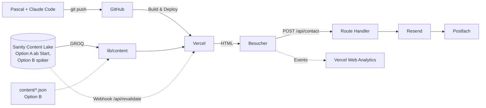

# Software-Briefing: brandarchitects.ch – Neubau

> **Version:** 2.0 (ersetzt 1.0 – Astro-Variante verworfen)
> **Erstellt:** 15. September 2026
> **Status:** Draft – Entscheide mit `[Empfehlung – bestätigen]` sind offen
> **Grundlage:** Finales Briefing 3.1 (Inhalt, Sitemap, Texte), Struktur-Briefing 1.3 (Module, Formular, Abnahme), Entscheide Pascal vom 15.09.2026: neues Repo, Next.js, Sanity-fähig, mehrsprachigkeitsfähig; Prototyp `brandarchitects` wird nicht weitergeführt
> **Rolle dieses Dokuments:** Technische Arbeitsgrundlage für den Bau mit Claude Code. Inhaltliche Fragen sind in Briefing 3.1 fixiert und werden referenziert, nicht neu entschieden.

---

## 0. Gefällte technische Entscheide (Referenzliste)

| Thema | Entscheid | Reversibilität |
|---|---|---|
| Framework | **Next.js 16, App Router, TypeScript** – neues Repo `brandarchitects/brandarchitects-website` | Niedrig – bewusst gewählt |
| Astro | Geprüft, verworfen (Begründung Kap. 5.1) | – |
| Styling | Tailwind CSS v4 + Design-Tokens als CSS-Variablen; Motion (ehem. Framer Motion) für sparsame Animation | Mittel |
| Inhalte | **Sanity-Datenmodell ab Tag 1**; Start wahlweise mit lokalen Dokumenten (Option B) oder direkt Sanity Free (Option A) – siehe Kap. 5.3 `[Empfehlung – bestätigen]` | Hoch, weil das Modell gleich bleibt |
| Rich Text | Portable Text (Sanitys Format) von Anfang an, gerendert mit `@portabletext/react` | – |
| Mehrsprachigkeit | `next-intl` mit Locale-Segment `app/[locale]/` ab Tag 1; Launch nur `de`; Default-Locale ohne URL-Präfix | Niedrig – deshalb jetzt |
| Formular | Route Handler `/api/contact` + Resend; Honeypot + Zeitprüfung | Hoch |
| Analytics | Vercel Web Analytics (Pro-Plan vorhanden, cookielos) | Hoch |
| Hosting | GitHub → Vercel, neues Projekt; `main` = Produktion, Branches = Previews | Hoch |
| Rendering | Statisch generiert (SSG); mit Sanity später ISR + Revalidation per Webhook | Hoch |

---

## 1. Produkt-Vision & Ziele

### 1.1 Problem Statement
Die bestehende Website zeigt nicht, was Brand Architects heute ist. Der Vercel-Prototyp war ein Rohbau ohne finale Inhalte, ohne Formularversand, ohne SEO-Fundament und ohne Weg zu CMS und Mehrsprachigkeit. Er wird nicht weitergeführt.

### 1.2 Lösung & USP (technisch)
Ein sauberer Neubau auf Next.js, gestalterisch anspruchsvoll (die Website ist die erste Arbeitsprobe), mit einem Content-Modell, das von Tag 1 so gebaut ist, wie Sanity es später erwartet – und mit einer Routing-Struktur, in der eine zweite Sprache ein Content-Thema ist, kein Umbau. Keine Datenbank, kein Login. Ein Server-Endpunkt für das Formular.

### 1.3 Erfolgskriterien
- [ ] Alle Seiten der Sitemap (Briefing 3.1, Kap. 8.2) live, mit echten Inhalten, ohne Platzhalter
- [ ] Gestalterisch klar über dem Prototyp: Typografie, Raster, Bildpräsentation gemäss `docs/design-spec.md`; Abnahme durch Pascal als Creative Director
- [ ] Kontaktformular: Anfrage nachweislich im Postfach; Vorbelegung `?thema=`; alle Zustände gemäss Struktur-Briefing
- [ ] Lighthouse mobil: Performance ≥ 90, Accessibility ≥ 95, SEO 100 (Next.js liefert mehr JavaScript als eine reine Statik-Site – 90 ist das ehrliche Ziel, 95+ mit Disziplin erreichbar)
- [ ] Sanity-Anbindung später: nur `lib/content/` tauschen, kein Template wird angefasst (Nachweis: Testlauf in Phase 8)
- [ ] Zweite Sprache später: neue Übersetzungsdatei + übersetzte Dokumente, keine Routing-Änderung (Nachweis: `en`-Dummy-Route in Phase 8, danach deaktiviert)
- [ ] Alte URLs einzeln weitergeleitet; Abnahmekriterien Briefing 3.1, Kap. 11 erfüllt

---

## 2. Zielgruppe

### 2.1 Besucher
Briefing 3.1, Kap. 2. Technisch relevant: Business-Publikum, Erstkontakt oft mobil (LinkedIn, Empfehlung), Vertiefung am Desktop. Beide Ansichten gleichwertig. Die sieben Nutzerwege (Kap. 2.3) enden alle auf `/kontakt/` – deshalb ein zentrales Formular mit Vorbelegung.

### 2.2 Redaktion (Pascal)
- **Technisches Level:** Kein Entwickler; arbeitet mit Claude Code, Vercel-Dashboard und später Sanity Studio
- **Hauptziel:** Inhalte und Cases pflegen, ohne Design oder Code anzufassen
- **Später:** eine zweite Sprache und ein CMS mit Klick-Oberfläche, ohne Neubau

---

## 3. Feature-Liste

### Must-Have (v1.0 – Launch)
| # | Feature | Beschreibung | Prio |
|---|---|---|---|
| 1 | Seitenstruktur | Sitemap Kap. 8.2 unter `app/[locale]/…`; `de` ohne Präfix; Trailing Slash konsequent | Hoch |
| 2 | Content-Modell | Sanity-Schemas für `case`, `service`, `page`, `faq`, `siteSettings`; lokale Dokumente nach exakt diesem Schema; typisierte Zugriffsfunktionen in `lib/content/` | Hoch |
| 3 | Modul-Bibliothek | Die 10 Module aus Struktur-Briefing Kap. 6 als Server-Komponenten; Client-Komponenten nur wo Interaktion (Navigation mobil, FAQ, Formular) | Hoch |
| 4 | Kontaktformular | Felder Struktur-Briefing Kap. 5; Zod-Validierung; Resend; Zustände; Vorbelegung `?thema=`; Progressive Enhancement | Hoch |
| 5 | Spam-Schutz | Honeypot + Zeitprüfung; Turnstile nur bei Bedarf | Hoch |
| 6 | SEO-Fundament | Metadata-API pro Seite (Titles Kap. 8.10), Canonical, `hreflang` vorbereitet, OG-Bilder, `sitemap.ts`, `robots.ts`, JSON-LD (Organization, ProfessionalService mit Service-Area, FAQPage) | Hoch |
| 7 | Bildpipeline | `next/image`, AVIF/WebP, responsive; Bild-Legende Pflichtfeld; Loader-Abstraktion, damit später Sanitys Image-CDN eingehängt wird | Hoch |
| 8 | Redirects | Einzeln in `next.config.ts`, mit Herkunftskommentar | Hoch |
| 9 | Rechtliches | Impressum, Datenschutz passend zu Vercel, Resend, Analytics; kein Cookie-Banner, solange keine Cookies gesetzt werden (Endfassung juristisch prüfen) | Hoch |
| 10 | Analytics | Vercel Web Analytics; Events `contact_submit_success`, `contact_submit_error`, `email_click` | Mittel |
| 11 | Barrierefreiheit | Tastatur, Fokus, Kontrast, Alt-Texte, semantische Struktur, `prefers-reduced-motion` | Hoch |
| 12 | Gestaltung | Design-Tokens, Typografie, Raster, Bildpräsentation aus `docs/design-spec.md`; Animation sparsam mit Motion | Hoch |

### Nice-to-Have (v1.1+)
| # | Feature | Beschreibung |
|---|---|---|
| 1 | Sanity Studio live | Projekt anlegen, Dokumente importieren, `lib/content/` auf Sanity-Client umstellen, ISR + Webhook, Studio unter `/studio` (Option A macht das zum Launch-Bestandteil) |
| 2 | Zweite Sprache | `en` (oder `fr`) aktivieren: Übersetzungsdatei, übersetzte Dokumente, Sprachschalter, `hreflang` scharf |
| 3 | Sanity Visual Editing | Klick auf Website → Feld im Studio (Presentation Tool) |
| 4 | Cloudflare Turnstile | Nur bei tatsächlichem Spam |
| 5 | Terminbuchung, Eingangsbestätigung, Entscheidungsratgeber, «Aktuell» | Gemäss Briefing 3.1 |

### Out of Scope
- Datenbank, Auth, Shop, Newsletter, Chatbot, Suche, Portfoliofilter, Blog, Ortsseiten
- Übernahme von Code aus dem Prototyp (Inhalte und Erkenntnisse ja, Code nein)

---

## 4. UI/UX Anforderungen

### 4.1 Plattform
Web, responsive 360–1920 px; aktuelle Browser.

### 4.2 Design-Prinzipien
Ruhig, präzise, eigenständig; Swiss Design als Basis mit erkennbarer Handschrift (Briefing 3.1, Kap. 8.9). Next.js gibt hier die Freiheit, die Pascal will: Scroll-gebundene Übergänge, Bildsequenzen, präzise Typografie-Animation – aber jede Bewegung muss einen Zweck haben und ohne JavaScript degradieren. Die UI-Spezifikation kommt aus `swiss-design-brief` nach `docs/design-spec.md`, bevor Phase 2 startet.

### 4.3 Key Screens
Startseite (8 Module, Kap. 8.3) · Fallseite (Struktur Kap. 6.5) · Leistungsseite (Textmechanik Kap. 8.4) · Standortbestimmung (Kap. 8.5) · Zusammenarbeit + FAQ (Kap. 8.6/8.8) · Kontakt (Struktur-Briefing Kap. 5).

### 4.4 Constraints
- Schweizer Hochdeutsch, ss, Sie; Sperrliste Kap. 7.2 gilt für Alt-Texte, Meta, Fehlermeldungen; `lang="de-CH"`
- Schriften selbst gehostet über `next/font/local`; keine Google-Fonts-Einbindung über Fremdserver
- UI-Texte (Buttons, Labels, Fehlermeldungen) nie hart im Code – immer aus `messages/de.json` (Voraussetzung für Sprache 2)

---

## 5. Technischer Stack & Architektur

### 5.1 Framework: Next.js – und warum nicht Astro

**Empfehlung: Next.js 16, App Router, TypeScript.** Ich trage deine Tendenz mit – nicht, weil Astro schlechter wäre, sondern weil deine drei Anforderungen zusammen den Ausschlag geben:

1. **Sanity.** Sanity und Next.js sind das kanonische Paar: `next-sanity`, Live-Preview, Visual Editing, ISR-Revalidation per Webhook – alles offiziell gepflegt und in Claude Codes Trainingsdaten am dichtesten. Mit Astro ginge es auch, aber mit weniger Werkzeug und weniger Beispielen.
2. **Gestaltung.** Das React-Ökosystem für Bewegung (Motion, GSAP, View Transitions) ist breiter; komplexe interaktive Module sind in einem Komponentenmodell einfacher zu bauen und zu warten als in Astros Insel-Architektur.
3. **Mehrsprachigkeit.** `next-intl` mit Locale-Segment ist ein etabliertes Muster; Sanitys Dokument-Lokalisierung fügt sich direkt ein.

**Astro geprüft – was es gebracht hätte:** null JavaScript per Default, damit bessere Ladezeit ohne Anstrengung, weniger Konfiguration, kleinere Angriffsfläche. **Was du dafür aufgibst:** wenig, wenn wir Disziplin halten. **Was du beachten musst:** Next.js zieht React auf jede Seite (~80–100 KB). Das ist kein Problem, solange wir Server-Komponenten als Standard nehmen und `'use client'` nur setzen, wo es Interaktion gibt. Ohne diese Disziplin wird die Website spürbar träger als der Prototyp – und das würde man sehen, weil die Website die Arbeitsprobe ist. Die Regel steht deshalb in `CLAUDE.md`.

**Ehrlich formuliert:** Für eine reine deutsche Website ohne CMS wäre Astro die einfachere Wahl gewesen. Mit Sanity und Mehrsprachigkeit als gesetzte Ziele ist Next.js die richtige.

### 5.2 Mehrsprachigkeit – warum jetzt, obwohl erst später nötig

Locale-Routing nachträglich einzubauen heisst, jede Seite, jeden Link und jede Metadata-Funktion zu verschieben. Deshalb ab Tag 1:

- Struktur `app/[locale]/…` mit `next-intl`; `routing.ts` definiert `locales: ['de']`, `defaultLocale: 'de'`, `localePrefix: 'as-needed'` – die deutsche Site läuft ohne `/de/`-Präfix, genau wie ohne i18n
- UI-Strings in `messages/de.json`; Inhalte tragen ein `language`-Feld (Sanity-Konvention)
- Alle internen Links über `Link` aus `next-intl`, nie über `next/link` direkt
- `hreflang` und `alternates` in der Metadata-Funktion vorbereitet, aktiv erst mit Sprache 2
- Zweite Sprache später = `locales: ['de','en']`, `messages/en.json`, übersetzte Dokumente, Sprachschalter im Header. Bewusst nicht am Start: Pfad-Übersetzung (`/arbeiten/` → `/work/`); sie lässt sich mit `next-intl` `pathnames` nachrüsten.

### 5.3 Inhalte – Sanity-Modell ab Tag 1

**Grundsatz:** Das Datenmodell ist von Anfang an Sanitys Datenmodell. Alle Templates lesen über typisierte Funktionen in `lib/content/` (`getCases()`, `getCase(slug, locale)`, `getService()`, `getPage()`, `getSiteSettings()`). Nur diese Schicht weiss, woher die Daten kommen.

**Zwei Startvarianten:**

**Option A – Sanity Free ab Tag 1.** `[Empfehlung]`
Sanity anlegen (Gratis-Plan: 20 Nutzer, 2 Datasets, unbegrenzte Locales, Live-Preview – für diese Website ausreichend, hart limitiert statt Überzahlung). Studio als Route `/studio` im selben Repo. Claude Code befüllt die Dokumente per Import-Skript aus den Briefing-Texten. Pascal pflegt ab dem ersten Tag in einer Klick-Oberfläche.
Warum ich das empfehle: «Sanity-fähig ohne Sanity» bedeutet, Sanitys Datenmodell nachzubauen (Portable Text, Referenzen, Bild-Objekte) – der Aufwand ist fast identisch, nur ohne den Nutzen. Und «später einbinden» ist der Punkt, an dem Projekte liegen bleiben. Kosten: CHF 0.

**Option B – lokale Dokumente, Sanity-Schema.**
Schemas in `sanity/schemas/` definieren (reine TypeScript-Objekte, kein Konto nötig), Typen mit `sanity typegen` generieren, Inhalte als JSON-Dokumente in `content/` nach genau diesen Typen, Rich Text als Portable-Text-Array. `lib/content/` liest lokale Dateien. Später: Sanity-Projekt anlegen, `content/` als NDJSON importieren, Loader tauschen, ISR aktivieren.
Wann sinnvoll: wenn Pascal bewusst noch kein weiteres Konto will oder die Klick-Oberfläche vor dem Launch keinen Wert hat. Nachteil: Portable Text von Hand ist mühsam – geht mit Claude Code, aber nicht im Editor.

**Schema (verbindlich, beide Optionen), aus Briefing 3.1 Kap. 6.4/6.5:**
- `case`: `title`, `slug`, `language`, `client`, `origin` (`brand-architects` | `former-agency`), `formerAgency`, `year`, `role`, `services[]` (Referenz auf `service`), `situation`, `question`, `assignment`, `decision`, `preserved`, `application` (Portable Text mit Bildblöcken + Legende), `result`, `partners[]`, `heroImage` (mit `alt`), `quote` (optional: text, name, function, company), `featured` (bool), `order`, `materialCleared` (bool), `contactTopic`, `relatedCase`, `seo` (title, description, ogImage)
- `service`: `title`, `slug`, `language`, `forWhom`, `triggers[]`, `youGet` (Portable Text), `whatItTakes`, `cases[]`, `questions[]`, `cta`, `seo`
- `page` (Standortbestimmung, Zusammenarbeit, Über uns, Impressum, Datenschutz): `title`, `slug`, `language`, `sections[]` (Modul-Blöcke), `seo`
- `faq`: `question`, `answer`, `language`, `order`
- `siteSettings`: Firmenname, Adresse, E-Mail, Telefon (optional), Navigation, Footer-Links, LinkedIn, Standard-OG-Bild – pro Sprache
- Lokalisierung: Dokument-Ebene (`language`-Feld, Sanity-Plugin `document-internationalization`), weil ganze Cases übersetzt werden, nicht einzelne Felder

### 5.4 Weitere Stack-Entscheide

| Bedarf | Entscheid | Warum |
|---|---|---|
| Styling | Tailwind CSS v4, Tokens aus `design-spec.md` in `globals.css` als `@theme` | Standard, mit dem Claude Code am zuverlässigsten arbeitet; Tokens halten die Handschrift konsistent |
| Animation | Motion (`motion/react`), nur in Client-Komponenten, `useReducedMotion` | Sparsam, zweckgebunden; kein GSAP zusätzlich |
| Komponenten | Eigene, kein shadcn/ui | Die Site braucht 10 Module und eine eigene Handschrift, keine Bibliothek-Optik |
| Rich Text | `@portabletext/react` mit eigenen Serializern (Bild mit Legende, Zitat) | Sanity-Format ab Tag 1 |
| Bilder | `next/image`; lokale Bilder aus `content/images/`; Loader-Funktion, die später `@sanity/image-url` nutzt | Ein Tausch, keine Template-Änderung |
| Schriften | `next/font/local`, Dateien im Repo, Lizenz geklärt | Datenschutz, Ladezeit |
| Formular | Route Handler `app/api/contact/route.ts` + Resend (Free: 3000 Mails/Monat, Domain verifizieren) | Ein Endpunkt, volle Kontrolle über Zustände |
| Validierung | Zod, serverseitig; Fehlertexte aus `messages/de.json` | Übersetzbar |
| Analytics | `@vercel/analytics`, cookielos | Im Pro-Plan; kein Banner |
| Qualität | TypeScript strict, ESLint, `next build` als Gate; Playwright-Smoke-Test für Formular und Navigation ab Phase 7 | Wenig, aber das Richtige |
| Rendering | SSG via `generateStaticParams`; mit Sanity: ISR (`revalidate`) + Webhook `/api/revalidate` | Schnell, günstig |

### 5.5 Architektur



**Daten und Verantwortung:** Inhalte im Repo bzw. bei Sanity (EU-Dataset wählbar); Personendaten nur aus dem Formular, nicht gespeichert, nicht geloggt; Analytics ohne Formularinhalte. **Kosten:** Vercel Pro vorhanden, Sanity Free, Resend Free, Domain vorhanden – laufend CHF 0 zusätzlich; einmalig Schriftlizenz.

### 5.6 Projektstruktur

```
brandarchitects-website/
├── CLAUDE.md
├── docs/                          # briefing-3-1.md, struktur-1-3.md, design-spec.md,
│                                  # content-rules.md, tech-briefing.md, redirects-inventar.md
├── messages/de.json               # UI-Strings; en.json später
├── i18n/routing.ts, request.ts    # next-intl
├── proxy.ts                       # Locale-Routing (Next.js 16: ehem. middleware)
├── app/
│   ├── [locale]/
│   │   ├── layout.tsx
│   │   ├── page.tsx               # Startseite
│   │   ├── arbeiten/page.tsx, arbeiten/[slug]/page.tsx
│   │   ├── leistungen/page.tsx, leistungen/[slug]/page.tsx
│   │   ├── standortbestimmung/, zusammenarbeit/, ueber-uns/, kontakt/,
│   │   ├── impressum/, datenschutz/
│   │   └── sitemap.ts, robots.ts, opengraph-image.tsx
│   ├── api/contact/route.ts
│   ├── api/revalidate/route.ts    # Option A / später
│   └── studio/[[...tool]]/page.tsx# Option A / später
├── components/
│   ├── modules/                   # Hero, ProjectCard, Figure, ServiceModule, ProcessStep,
│   │                              # Quote, Faq, ContactForm, ContactClose, Header, Footer
│   ├── portable-text/             # Serializer
│   └── seo/JsonLd.tsx
├── lib/
│   ├── content/                   # index.ts (öffentliche API), local.ts, sanity.ts
│   ├── image.ts                   # Loader-Abstraktion
│   └── schemas/contact.ts         # Zod
├── sanity/                        # schemas/, sanity.config.ts, typegen
├── content/                       # Option B: JSON-Dokumente + images/
├── public/fonts/
└── next.config.ts                 # redirects, images, trailingSlash
```

### 5.7 Formular-Endpunkt – Verhalten
Wie in v1: `POST`, Zod-Validierung feldgenau, Honeypot/Zeitprüfung stumm ablehnen, Resend mit `reply-to` Absender, Erfolg erst nach Resend-Bestätigung, Eingaben bleiben bei Fehler erhalten, kein Logging von Inhalten, funktioniert ohne JavaScript (Server Action als Fallback), Vorbelegung `?thema=` editierbar.

---

## 6. Projektplan in Claude-Code-Sessions

Reihenfolge nach Risiko: Erst das, was das Projekt später teuer machen würde (Routing, Content-Modell), dann das, was scheitern kann (Formular), dann Gestaltung und Inhalte.

| Phase | Ziel | Was am Ende funktioniert | Sessions |
|---|---|---|---|
| **0 – Fundament** | Neues Repo, `create-next-app` (TS, Tailwind v4, App Router), `next-intl` mit `[locale]`, `CLAUDE.md`, `docs/`, Vercel-Projekt verknüpft | Leere Seiten der Sitemap unter `de` ohne Präfix; Preview-URL; Build grün | 1–2 |
| **1 – Content-Modell** | Sanity-Schemas, Typen, `lib/content/` mit lokalem oder Sanity-Loader (je Option), Portable-Text-Renderer, Geberit + TrustWork als Dokumente mit echten Texten | `/arbeiten/geberit/` zeigt Inhalt aus dem Modell, ungestaltet | 2 |
| **2 – Formular** | `/api/contact`, Zod, Honeypot, Resend, Zustände; Kontaktseite roh | Test-Anfrage von der Preview landet im Postfach | 1–2 (+ DNS) |
| **3 – Design-System** | `design-spec.md` → Tokens, Typografie, Raster, Schriften; Header/Footer; die 10 Module mit Beispielinhalt; Motion-Grundregeln | Musterseite mit allen Modulen, mobil + Desktop, abgenommen von Pascal | 3 |
| **4 – Startseite + Fallseiten** | Acht Module mit Website-Texten; Fallseiten-Template mit Bildmodulen | Startseite und beide Leitcases abnahmefähig | 2 |
| **5 – Unterseiten** | Leistungen (4), Standortbestimmung, Zusammenarbeit + FAQ, Über uns, Kontakt final, Impressum, Datenschutz | Sitemap vollständig, keine Platzhalter | 2–3 |
| **6 – SEO, Schema, Redirects** | Metadata, OG-Bilder, JSON-LD, Sitemap, robots, Redirect-Mapping | Rich-Results-Test grün; Redirects getestet | 1 |
| **7 – Abnahme** | Kap. 11 (3.1) + Abnahmeliste (Struktur Kap. 10); Lighthouse; Tastatur; Sperrlisten-Suche; Playwright-Smoke | Abnahmeprotokoll ohne offene Punkte | 1 |
| **8 – Zukunftstest** | Option B: Probe-Import nach Sanity auf Test-Projekt; `en`-Dummy-Locale aktivieren, prüfen, wieder deaktivieren | Nachweis, dass CMS und Sprache 2 ohne Umbau gehen | 1 |
| **9 – Go-Live** | Domain, www-Redirect, Search Console, Sitemap, Analytics | brandarchitects.ch live | 0.5 (+ DNS) |
| **10 – Nach Launch** | Google Business Profile, Anfragen-Liste, Messung nach 6 Wochen | Messsystem Kap. 10 läuft | – |

Gesamt: rund 15–19 Sessions Bauzeit (gegenüber 12–16 mit Astro – der Preis für Sanity-Modell, i18n und höheren Gestaltungsanspruch). Kalender hängt an Inhalten und Design-Spec, nicht am Code.

---

## 7. Was Pascal selbst erledigen muss

| # | Aufgabe | Wann |
|---|---|---|
| 1 | Entscheid Option A (Sanity ab Start) oder B (lokal, Sanity-Schema) | vor Phase 1 |
| 2 | Bei A: Sanity-Konto anlegen (EU-Dataset), Projekt-ID und Token als Vercel-Umgebungsvariablen | Phase 1 |
| 3 | DNS-Zugang zu brandarchitects.ch klären; heutiges Hosting und Mail-Setup dokumentieren | vor Phase 2 |
| 4 | Resend-Konto, Domain verifizieren, API-Key in Vercel; Ziel-Postfach festlegen | Phase 2 |
| 5 | `swiss-design-brief` → `docs/design-spec.md`; Logo; Schriftdateien mit Web-Lizenz | vor Phase 3 |
| 6 | Case-Inventar (3.1, Kap. 6.4), Bilder, Freigaben Geberit/TrustWork | vor Phase 1 (Texte) / Phase 4 (Bilder) |
| 7 | Alte URLs exportieren (Search Console, Crawl) | vor Phase 6 |
| 8 | Impressum/Datenschutz freigeben (Vercel, Resend, Analytics, ggf. Sanity) | Phase 5 |
| 9 | Search Console, Google Business Profile | Phase 9/10 |
| 10 | Altes Vercel-Projekt `brandarchitects` nach Go-Live archivieren | Phase 10 |

---

## 8. Offene Fragen & Risiken

| # | Frage / Risiko | Typ | Status |
|---|---|---|---|
| 1 | Option A oder B | Prozess | `[Empfehlung A – bestätigen]` |
| 2 | Welche zweite Sprache ist wahrscheinlich (en/fr)? Beeinflusst nur Vorbereitung von `hreflang` und Schriftumfang | Business | Offen |
| 3 | DNS/Registrar/Mail heute | Technisch | Offen |
| 4 | Schrift mit Web-Lizenz | Design/Recht | Offen |
| 5 | JavaScript-Disziplin: Next.js verführt zu `'use client'` überall; Gegenmassnahme: Regel in `CLAUDE.md`, Bundle-Check in Abnahme | Technisch | Mitigiert |
| 6 | Sanity-Free-Limits (API-Requests) bei ISR mit kurzem `revalidate`: Gegenmassnahme Webhook-Revalidation statt Zeit-Intervall | Technisch | Mitigiert |
| 7 | Inhalte später als Code: Phasen 0–3 laufen parallel zur Inhaltsarbeit; 4–5 erst mit Inventar und Texten | Projekt | Offen |
| 8 | Zustellbarkeit Formular-Mails | Technisch | Domain-Verifizierung, Test Phase 2 |

---

## 9. Prompt-Kontext für Claude Code (Build-Ready)

> Wird 1:1 in `CLAUDE.md` übernommen (Beilage). Start jeder Session: `docs/` lesen, dann Phasenauftrag.

**System-Kontext:** Du bist Senior-Entwickler für eine Next.js-16-Website (App Router, TypeScript, Tailwind v4, next-intl, Sanity-Datenmodell). Inhalte sind in `docs/briefing-3-1.md` und `docs/struktur-1-3.md` verbindlich; du erfindest keine Inhalte. Gestaltung folgt `docs/design-spec.md`, Sprache `docs/content-rules.md`.

**Stack:** Next.js 16 App Router + TypeScript + Tailwind v4 + next-intl + Sanity-Schema/Portable Text (lokal oder Sanity Free) + Resend + Vercel Web Analytics + GitHub → Vercel

**Starte mit (Phase 0):**
1. `npx create-next-app@latest brandarchitects-website` (TypeScript, Tailwind, App Router, `src`-Verzeichnis nein, ESLint ja)
2. `next-intl` installieren; `i18n/routing.ts` (`locales: ['de']`, `defaultLocale: 'de'`, `localePrefix: 'as-needed'`), `i18n/request.ts`, `proxy.ts`, `app/[locale]/layout.tsx`
3. Leere Routen für die gesamte Sitemap anlegen; `trailingSlash: true` in `next.config.ts`
4. `docs/`, `messages/de.json`, `CLAUDE.md` anlegen
5. `npm run build` und `npm run lint` grün; Push auf `main`; Vercel-Projekt verknüpfen; Preview-URL melden

**Vor jedem Commit:** Build und Lint grün · keine Sperrlisten-Begriffe im Content · keine Platzhalter auf fertigen Seiten · keine Secrets im Repo · kein neues `'use client'` ohne Begründung im Commit
